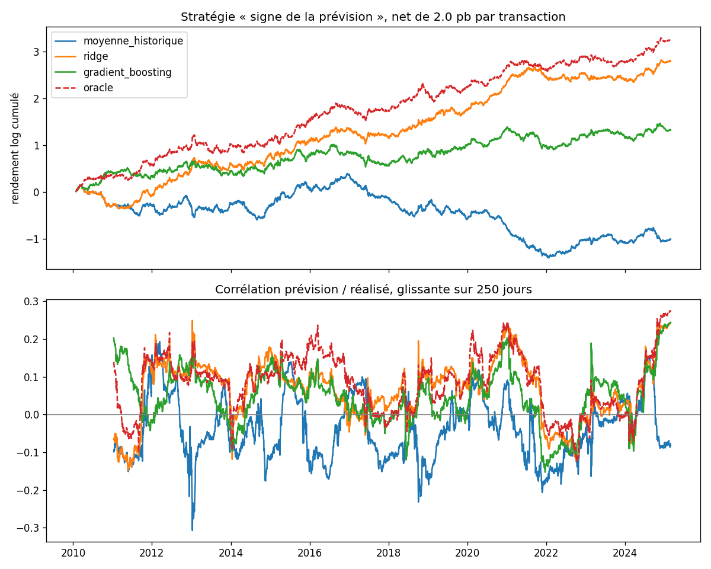

# Prédiction d'un actif financier

Pipeline de machine learning sur une série synthétique à signal faible : création de variables, entraînement et évaluation chronologique hors échantillon.

## Pourquoi une série synthétique

Sur des données de marché réelles, on ne sait jamais ce qui était prévisible. Un modèle qui « marche » peut avoir trouvé un vrai signal, profité d'une fuite d'information ou simplement eu de la chance. Ici, la série est générée avec une part prévisible **connue** : l'espérance conditionnelle vraie du rendement est enregistrée à chaque date. On peut donc comparer chaque modèle à un **oracle**, la meilleure prévision possible, et mesurer quelle part du signal il récupère réellement.

Le signal est volontairement faible, comme sur un vrai marché : environ 1 % de la variance des rendements est prévisible. Les 99 % restants sont du bruit.

## Ce que contient le pipeline

| Étape | Fichier | Points clés |
|---|---|---|
| Données | [actif/data.py](actif/data.py) | Volatilité GARCH(1,1) (regroupement des périodes agitées), signal = facteur exogène persistant + momentum non linéaire, part prévisible R² réglable |
| Variables | [actif/features.py](actif/features.py) | 15 variables : rendements retardés, momentum 5/20/60 j, volatilités, écart à la moyenne mobile, facteur exogène et ses transformations. Toutes calculées avec l'information disponible en t |
| Modèles | [actif/models.py](actif/models.py) | Moyenne historique (référence), ridge (α choisi par validation chronologique interne), gradient boosting fortement régularisé |
| Évaluation | [actif/evaluation.py](actif/evaluation.py) | Walk-forward à fenêtre croissante, réentraînement annuel, embargo de 5 jours ; cible normalisée par la volatilité |
| Robustesse | [actif/robustesse.py](actif/robustesse.py) | Même expérience sur 10 séries indépendantes |

### Les garde-fous contre l'auto-illusion

Sur un signal aussi faible, la moindre erreur de protocole produit des résultats spectaculaires et faux. Le pipeline en contient quatre :

1. **Test d'absence de fuite du futur.** On remplace toutes les données postérieures à une date t par des valeurs aléatoires et on vérifie que les variables calculées jusqu'à t restent identiques ([tests/test_pipeline.py](tests/test_pipeline.py)).
2. **Validation strictement chronologique.** Aucune validation croisée aléatoire, y compris pour les hyperparamètres (`TimeSeriesSplit`) ; l'`early_stopping` du gradient boosting est désactivé, car il tire son jeu de validation au hasard.
3. **Contrôle placebo.** Chaque expérience est relancée sur la même série sans aucun signal. Un protocole sain ne doit rien y trouver.
4. **Tests statistiques, pas seulement des scores.** Test de Diebold-Mariano (erreurs HAC de Newey-West) contre la prévision nulle ; intervalle de confiance du ratio de Sharpe par bootstrap par blocs, qui préserve l'autocorrélation.

## Résultats

### Robustesse sur 10 graines (`python -m actif.robustesse`)

| Série | Modèle | R² hors échantillon | Corrélation de rang (IC) | Sharpe net | Bat la prévision nulle (p < 0,05) |
|---|---|---:|---:|---:|---:|
| Signal | Oracle (plafond) | 1,37 % | 0,100 | 1,26 | 10/10 |
| Signal | **Ridge** | **0,86 %** | **0,079** | **1,01** | **8/10** |
| Signal | Gradient boosting | −0,10 % | 0,058 | 0,66 | 0/10 |
| Signal | Moyenne historique | −0,02 % | −0,016 | 0,06 | 0/10 |
| Placebo | Ridge | −0,07 % | −0,010 | −0,03 | 0/10 |
| Placebo | Gradient boosting | −1,31 % | −0,001 | −0,22 | 0/10 |

Sharpe net de 2 points de base par transaction ; R² calculé sur rendements normalisés par la volatilité, contre la prévision nulle.

### Ce que les chiffres disent

- **La ridge récupère environ 60 % du signal atteignable** (0,86 % de R² contre 1,37 % pour l'oracle) et bat la prévision nulle de façon significative sur 8 séries sur 10. Le signal est surtout linéaire dans les variables fournies, et le modèle le plus simple l'exploite le mieux.
- **Le gradient boosting est le piège classique du signal faible.** Il a une corrélation positive avec le futur (IC 0,058), donc un Sharpe positif, mais un R² négatif : ses prévisions sont trop amples et il ajoute plus d'erreur qu'il ne capte de signal. Sur la graine 0, il change aussi deux fois plus souvent de position que la ridge (71 contre 33 allers-retours par an), ce qui augmente les coûts. Un Sharpe positif seul aurait fait conclure à tort qu'il fonctionne.
- **Le placebo ne détecte rien.** Aucun modèle ne passe le test de significativité sur les séries sans signal : le protocole ne fabrique pas de fausses découvertes. Le gradient boosting y perd même 1,3 % de R², ce qui mesure directement son surapprentissage.
- **Sur une seule série, le hasard pèse lourd.** Sur la graine 0, l'intervalle de confiance à 95 % du Sharpe de la ridge va de 0,37 à 1,46. D'où l'étude sur 10 graines plutôt qu'un seul résultat.



## Utilisation

```bash
pip install -r requirements.txt
python -m actif.run                    # une série + placebo → resultats/
python -m actif.run --r2 0.005 --cost-bp 5   # signal plus faible, coûts plus élevés
python -m actif.robustesse             # 10 graines (~1 min)
python -m pytest                       # tests de non-fuite, protocole, placebo
```

## Limites

- Les données sont synthétiques : les résultats valident la méthode, pas une stratégie de marché. Sur des données réelles, le signal n'est ni stationnaire ni connu.
- La stratégie « signe de la prévision » ne sert qu'à mesurer la valeur économique des prévisions. Elle ignore le dimensionnement des positions, le glissement de prix et le coût de financement.
- La part prévisible réalisée (R² de l'oracle, 1,37 % en moyenne) diffère un peu du paramètre nominal (1 %), car le momentum et le facteur exogène sont corrélés. C'est pourquoi les modèles sont comparés à l'oracle mesuré plutôt qu'au paramètre.
